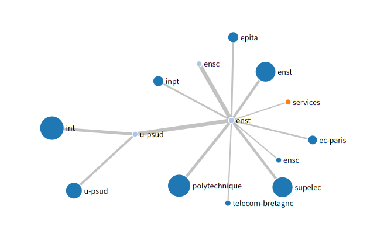

# Inspircd map generator #

## Usage ##

```
Usage of ./ircmap:
  -all
    	Don't scrub unrecognized nodes
  -listen string
    	Address to listen on
  -o string
    	Output format (dot, json, raw) (default "raw")
  -serve
    	Run as server (default true)
  -stdin
    	Use stdin instead of network for map source
  -url string
    	Location of the inspircd stats page (default "http://localhost:8000/stats")
```

ircmap understands the following environment variables:

* IRCMAP_SERVER_DOMAIN: A domain name to scrub from the end of the ServerName to make a human-readable label
* IRCMAP_HUB_PREFIX: A hostname prefix to scrub from the beginning of the ServerName to indicate a node is a hub
* IRCMAP_LEAF_PREFIX: A hostname prefix to scrub from the beginning of the ServerName to indicate a node is a leaf
* IRCMAP_STATS_URL: A URL on which inspircd's m_httpd_stats is served, to get values
* IRCMAP_LISTEN_ADDRESS: For server mode, an adress on which ircmap listens. defaults to ":http"
* IRCMAP_TLS_CERT: A TLS certificate for the webserver
* IRCMAP_TLS_KEY: A TLS certificate key for the webserver

## Server Mode ##

In -serve mode (the default), ircmap will listen on a port, serve a static directory of files, and return *json* and *dot*
maps.  
This is typically used to serve a html page and javascript to fetch and render the json representation. The static/
folder contains such an implementation

## One-shot Mode ##

In one-shot mode, ircmap will fetch the map source either from an url or stdin and output it to stdout. Useful for
testing. This is not compatible with server mode.

## Note on defaults ##

This was built to be used with servers in the [Rezosup](https://rezosup.org) network of french universities. The default
values are thought to work in that context.

## Example

An example is available at http://irc.rezel.net

An example screenshot:


